# 🧵 Concorrência e Multithreading em Java

> Projeto de estudos desenvolvido com **Java 21** + **Quarkus 3**, cobrindo os principais conceitos de programação concorrente na plataforma Java — de `ExecutorService` até Virtual Threads e `CompletableFuture`.

---

## 🚀 Tecnologias

| Tecnologia | Versão |
|---|---|
| Java | 21 (LTS) |
| Quarkus | 3.36.3 |
| Maven Wrapper | 3.x |

---

## ⚙️ Setup do Projeto

### Criar o projeto (referência)

```shell
quarkus create app br.com.artantech:app \
  --java=21 \
  --extension='resteasy-reactive,resteasy-reactive-jackson,smallrye-health,hibernate-validator,vertx,smallrye-openapi'
```

### Compilar as classes

> ⚠️ Execute sempre a partir da pasta `app/`

```shell
./mvnw compile -q && echo "BUILD OK"
```

### Rodar em modo dev (live reload)

```shell
./mvnw quarkus:dev
```

> A Dev UI estará disponível em: <http://localhost:8080/q/dev/>

### Empacotar a aplicação

```shell
./mvnw package
```

Gera o arquivo `target/quarkus-app/quarkus-run.jar`.

```shell
java -jar target/quarkus-app/quarkus-run.jar
```

### Build nativo (GraalVM)

```shell
./mvnw package -Dnative
# Ou via container (sem GraalVM local):
./mvnw package -Dnative -Dquarkus.native.container-build=true
```

---

## 📚 Conteúdo do Curso

---

## 🟢 Aula 2 — Executors e Thread Pools

Nesta aula exploramos o framework `java.util.concurrent.Executors`, que abstrai o gerenciamento manual de threads. O foco é entender os diferentes tipos de pools de threads, quando usar cada um, e como o ciclo de vida de um `ExecutorService` deve ser controlado corretamente.

---

### Exercício 1 — Tarefas CPU-Bound com `FixedThreadPool`

**Classe:** `br.com.artantech.aula02.Ex1CpuBoundTasksExample`

Demonstra o uso de `Executors.newFixedThreadPool(n)` para executar tarefas que consomem intensamente a CPU (CPU-bound). O número de threads do pool é igual ao número de núcleos do processador (`Runtime.getRuntime().availableProcessors()`), evitando troca excessiva de contexto. Cada tarefa realiza um somatório longo para simular carga computacional real.

**Conceitos abordados:**
- `FixedThreadPool` e sua relação com o número de CPUs
- Submissão de tarefas via `executor.submit()`
- Coleta de resultados com `Future<Long>`

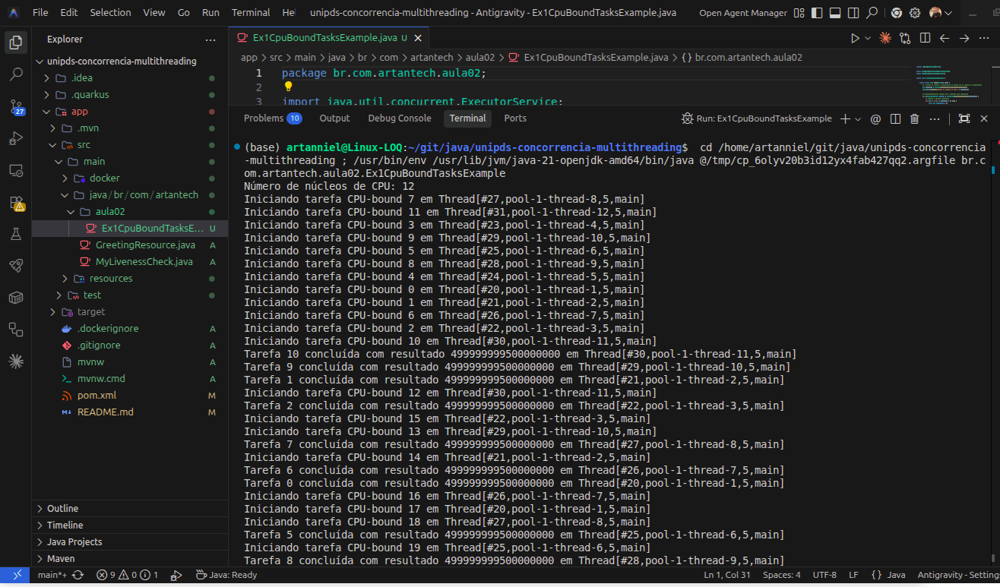

---

### Exercício 2 — Tarefas I/O-Bound com Virtual Threads

**Classe:** `br.com.artantech.aula02.Ex2IoBoundVirtualThreadsExample`

Demonstra o uso de `Executors.newVirtualThreadPerTaskExecutor()` (Java 21+) para executar 100.000 tarefas I/O-bound de forma eficiente. Diferente das threads da plataforma (platform threads), as virtual threads são extremamente leves — não há pooling, pois o custo de criar e destruir cada uma é negligenciável. O `Thread.sleep()` simula uma espera de rede sem bloquear uma thread do sistema operacional.

**Conceitos abordados:**
- Virtual Threads (Project Loom — Java 21)
- `newVirtualThreadPerTaskExecutor()`
- Escalabilidade em cenários de alta concorrência I/O

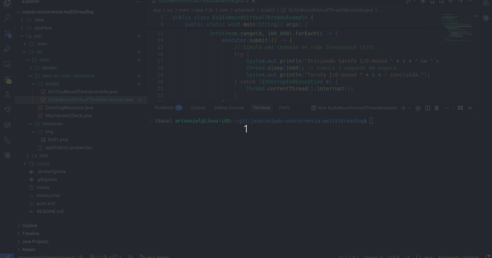

---

### Exercício 3 — Tarefas Agendadas com `ScheduledExecutorService`

**Classe:** `br.com.artantech.aula02.Ex3ScheduledTasksExample`

Demonstra três formas de agendamento com `Executors.newScheduledThreadPool(n)`:

| Método | Comportamento |
|---|---|
| `schedule()` | Executa **uma vez** após um atraso fixo |
| `scheduleAtFixedRate()` | Executa em intervalos fixos, **independente do tempo de execução** da tarefa |
| `scheduleWithFixedDelay()` | Executa com um atraso fixo **após o término** da execução anterior |

A diferença crucial entre `AtFixedRate` e `WithFixedDelay` fica evidente quando a tarefa demora mais que o intervalo configurado.

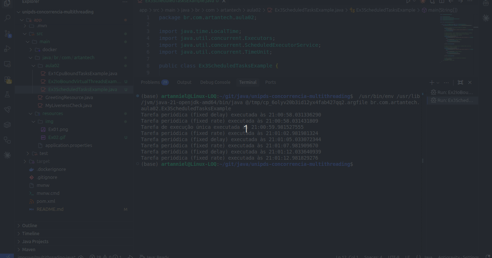

---

### Exercício 4 — Ciclo de Vida de Executors

**Classe:** `br.com.artantech.aula02.Ex4ExecutorLifecycleExample`

Demonstra as duas formas de encerrar um `ExecutorService` corretamente:

1. **`try-with-resources`** (Java 19+): forma moderna e recomendada, onde `close()` chama `shutdown()` e aguarda a conclusão das tarefas automaticamente.
2. **Desligamento manual** com `shutdown()` + `awaitTermination()` + `shutdownNow()`: padrão para versões mais antigas ou cenários onde se precisa de controle granular sobre o timeout de encerramento.

**Conceitos abordados:**
- `shutdown()` vs `shutdownNow()`
- `awaitTermination()` para drenagem graciosa
- `AutoCloseable` em `ExecutorService`

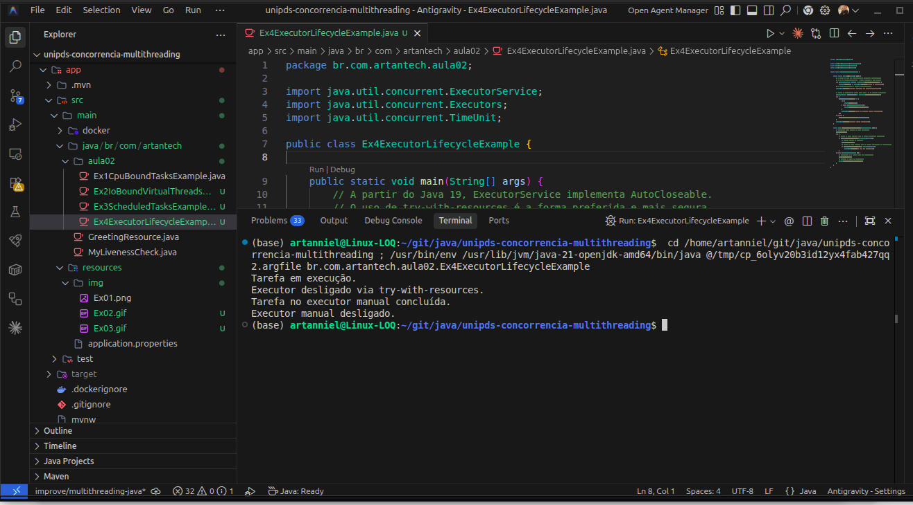

---

## 🟡 Aula 3 — Coleções Thread-Safe

Nesta aula exploramos as coleções concorrentes do pacote `java.util.concurrent`, que resolvem os problemas de `ConcurrentModificationException` e condições de corrida sem exigir sincronização manual com `synchronized`.

---

### Exercício 1 — Contenção em Mapas: `synchronizedMap` vs `ConcurrentHashMap`

**Classe:** `br.com.artantech.aula03.Ex1MapContentionExample`

Compara o desempenho de `Collections.synchronizedMap(new HashMap<>())` com `ConcurrentHashMap` sob alta contenção de múltiplas threads. O `synchronizedMap` usa um único lock global, bloqueando todas as threads para cada operação. Já o `ConcurrentHashMap` usa lock por segmento (striping), permitindo acesso concorrente verdadeiro à maior parte do mapa.

**Resultado esperado:** `ConcurrentHashMap` é significativamente mais rápido em cenários com muitas threads.

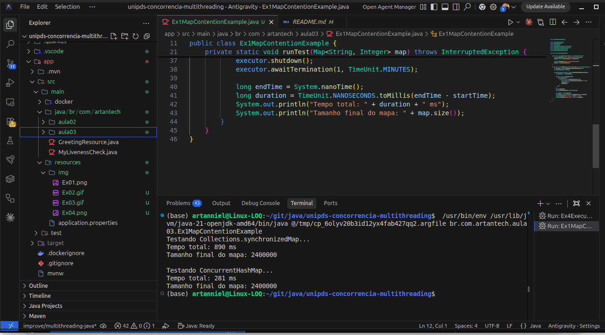

---

### Exercício 2 — Padrão Listener com `CopyOnWriteArrayList`

**Classe:** `br.com.artantech.aula03.Ex2CopyOnWriteListenerExample`

Demonstra o uso de `CopyOnWriteArrayList` no padrão Observer/Listener. Quando um listener é adicionado durante uma iteração ativa em outra thread, uma lista comum lançaria `ConcurrentModificationException`. A `CopyOnWriteArrayList` resolve isso criando uma nova cópia do array a cada escrita — a iteração em andamento usa o snapshot antigo e não é afetada.

**Conceitos abordados:**
- `CopyOnWriteArrayList` e sua semântica de cópia-na-escrita
- Segurança de iteração concorrente
- Trade-off: ideal para cenários de leitura intensa, custoso para escritas frequentes

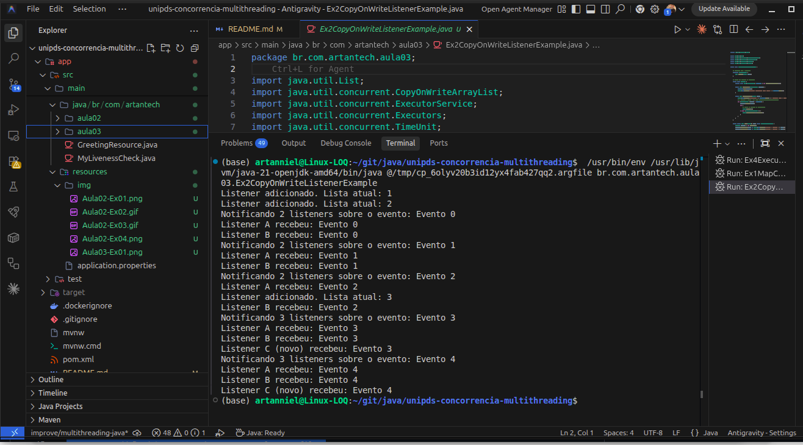

---

### Exercício 3 — Produtor-Consumidor com `BlockingQueue`

**Classe:** `br.com.artantech.aula03.Ex3ProducerConsumerBlockingQueueExample`

Implementa o clássico padrão Produtor-Consumidor usando `ArrayBlockingQueue` com capacidade limitada. O produtor chama `put()` (bloqueia se a fila estiver cheia) e o consumidor chama `take()` (bloqueia se a fila estiver vazia). Essa abordagem elimina a necessidade de `wait()/notify()` manual, tornando o código limpo e seguro.

**Conceitos abordados:**
- `ArrayBlockingQueue` com capacidade limitada (back-pressure natural)
- `put()` e `take()` como mecanismo de sincronização implícita
- Virtual Threads + BlockingQueue como padrão moderno

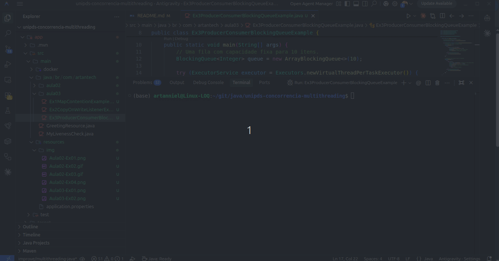

---

## 🔵 Aula 4 — Sincronizadores

Nesta aula exploramos os sincronizadores de alto nível do `java.util.concurrent` — ferramentas que coordenam a execução entre múltiplas threads sem expor locks explícitos.

---

### Exercício 1 — Inicialização de Serviços com `CountDownLatch`

**Classe:** `br.com.artantech.aula04.Ex1ServiceStartupLatchExample`

Simula a inicialização paralela de três serviços (`DatabaseService`, `CacheService`, `MessagingService`). A thread principal aguarda com `latch.await()` até que todos os serviços chamem `latch.countDown()`. É um uso clássico de `CountDownLatch` para aguardar que N eventos ocorram antes de prosseguir — o latch não pode ser reutilizado após atingir zero.

**Conceitos abordados:**
- `CountDownLatch` como barreira de espera one-shot
- `await()` bloqueante vs `await(timeout, unit)` com timeout

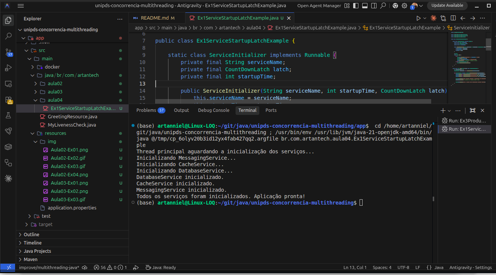

---

### Exercício 2 — Barreira de Fases com `CyclicBarrier`

**Classe:** `br.com.artantech.aula04.Ex2CyclicBarrierSolverExample`

Demonstra o `CyclicBarrier` com 3 workers executando em duas fases. Cada worker chama `barrier.await()` ao final de cada fase e fica bloqueado até que **todos** os workers cheguem à barreira. Ao contrário do `CountDownLatch`, o `CyclicBarrier` é reutilizável — ele se reinicia automaticamente para a próxima fase. Uma ação opcional (Runnable) pode ser executada quando a barreira é quebrada.

**Conceitos abordados:**
- `CyclicBarrier` para sincronização em fases reutilizáveis
- Ação da barreira (`barrierAction`) executada na última thread a chegar
- Diferença fundamental entre `CyclicBarrier` e `CountDownLatch`

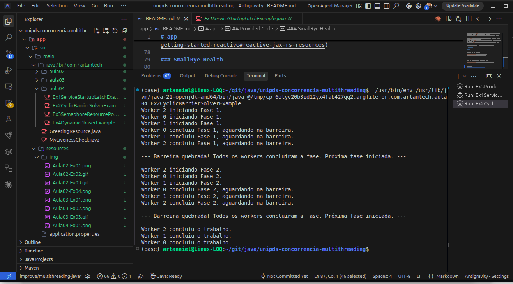

---

### Exercício 3 — Pool de Conexões com `Semaphore`

**Classe:** `br.com.artantech.aula04.Ex3SemaphoreResourcePoolExample`

Simula um pool de conexões com limite de 3 conexões simultâneas usando `Semaphore(3, true)`. 10 threads virtuais tentam obter uma conexão: `semaphore.acquire()` bloqueia se não houver permissões disponíveis, e `semaphore.release()` no bloco `finally` garante que a permissão sempre seja devolvida. O modo "fair" (`true`) garante que as threads sejam atendidas na ordem de chegada (FIFO).

**Conceitos abordados:**
- `Semaphore` para controle de acesso a recursos limitados
- Semáforo justo (fair) vs não-justo
- Uso obrigatório de `release()` em bloco `finally`

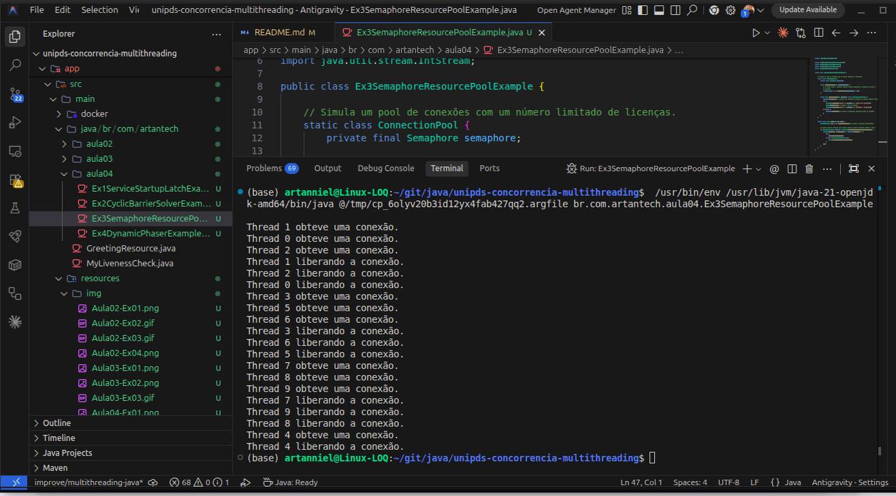

---

### Exercício 4 — Sincronização Dinâmica com `Phaser`

**Classe:** `br.com.artantech.aula04.Ex4DynamicPhaserExample`

Demonstra o `Phaser`, o sincronizador mais flexível da API. Diferente do `CyclicBarrier`, o `Phaser` permite que participantes se registrem e se desregistrem dinamicamente entre as fases. No exemplo, 4 tarefas participam da Fase 0, mas apenas as de ID par continuam para a Fase 1 — as demais se desregistram com `arriveAndDeregister()`, reduzindo o número de participantes esperados.

**Conceitos abordados:**
- `Phaser` com registro/desregistro dinâmico de participantes
- `arriveAndAwaitAdvance()` vs `arriveAndDeregister()`
- `Phaser` como generalização de `CountDownLatch` + `CyclicBarrier`

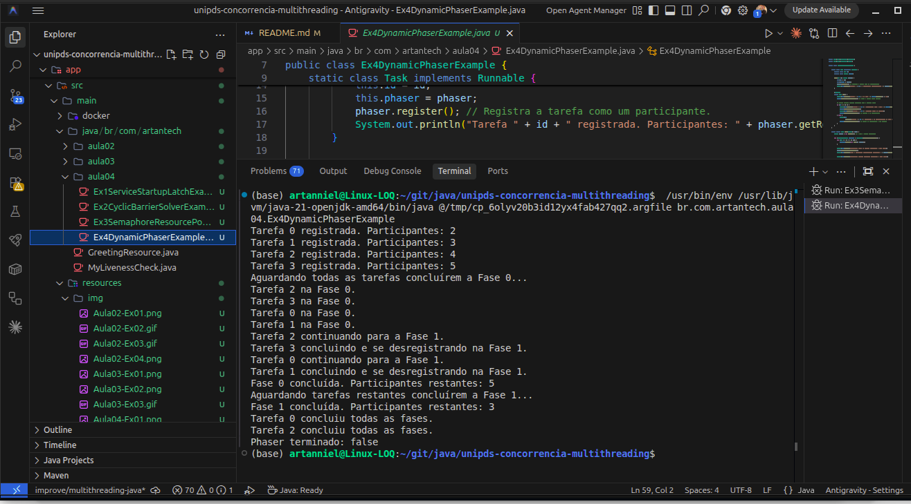

---

## 🟠 Aula 5 — Fork/Join Framework

Nesta aula exploramos o framework Fork/Join, introduzido no Java 7, projetado para tarefas que podem ser **divididas recursivamente** em subtarefas menores (divide-and-conquer), executadas em paralelo e depois combinadas.

---

### Exercício 1 — Soma Paralela com `RecursiveTask`

**Classe:** `br.com.artantech.aula05.Ex1ForkJoinSumExample`

Implementa a soma de 1 milhão de números usando `RecursiveTask<Long>`. A tarefa divide o array ao meio recursivamente até atingir o limiar (`THRESHOLD = 10.000`). A otimização chave está em usar `leftTask.fork()` + `rightTask.compute()` + `leftTask.join()`: a subtarefa da esquerda é enviada ao pool (potencialmente para outra thread roubá-la — work stealing), enquanto a da direita é executada diretamente na thread atual, maximizando o uso de CPU sem overhead de agendamento.

**Conceitos abordados:**
- `ForkJoinPool.commonPool()` e `RecursiveTask`
- Estratégia `fork() + compute() + join()` vs `invokeAll()`
- Work-stealing scheduler

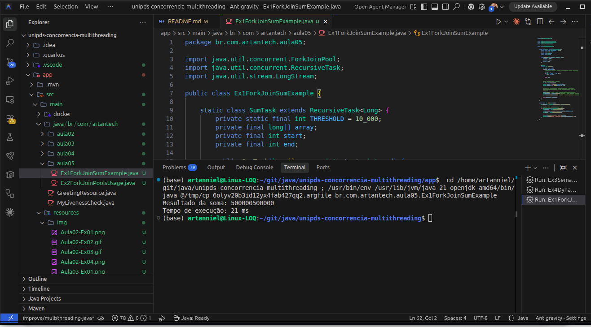

---

### Exercício 2 — `commonPool` vs Pool Customizado

**Classe:** `br.com.artantech.aula05.Ex2ForkJoinPoolsUsage`

Compara o uso do `ForkJoinPool.commonPool()` (pool compartilhado da JVM, usado internamente por parallel streams) com um `ForkJoinPool` customizado de paralelismo 4. O pool customizado é essencial para isolar cargas de trabalho intensas e evitar que monopolizem o `commonPool`, prejudicando outras partes da aplicação (como parallel streams em outros módulos).

**Conceitos abordados:**
- Perigos de monopolizar o `commonPool`
- Criação de `ForkJoinPool` com paralelismo customizado
- `try-with-resources` para fechar pools customizados

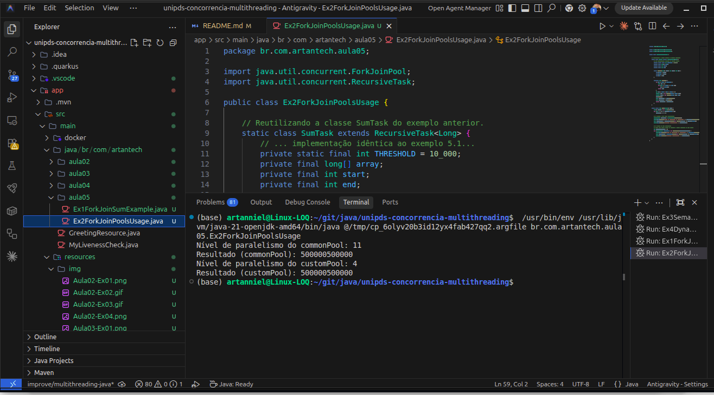

---

## 🟣 Aula 6 — CompletableFuture

Nesta aula exploramos a API de programação assíncrona do Java: `CompletableFuture`. Ela permite encadear operações assíncronas de forma declarativa, combinar múltiplas futures e tratar erros com elegância — sem callbacks aninhados ("callback hell").

---

### Exercício 1 — `thenApply` vs `thenCompose`

**Classe:** `br.com.artantech.aula06.Ex1ThenApplyVsThenCompose`

Demonstra a diferença crucial entre os dois operadores de transformação:

| Operador | Análogo a | Retorno | Quando usar |
|---|---|---|---|
| `thenApply(f)` | `map()` em Stream | `CF<U>` | Transformação síncrona (não retorna CF) |
| `thenCompose(f)` | `flatMap()` em Stream | `CF<U>` (achatado) | Quando a função retorna outra `CF` |

Usar `thenApply` com uma função que retorna `CompletableFuture` resulta em `CompletableFuture<CompletableFuture<T>>` — um tipo aninhado indesejado. `thenCompose` "achata" o resultado automaticamente.

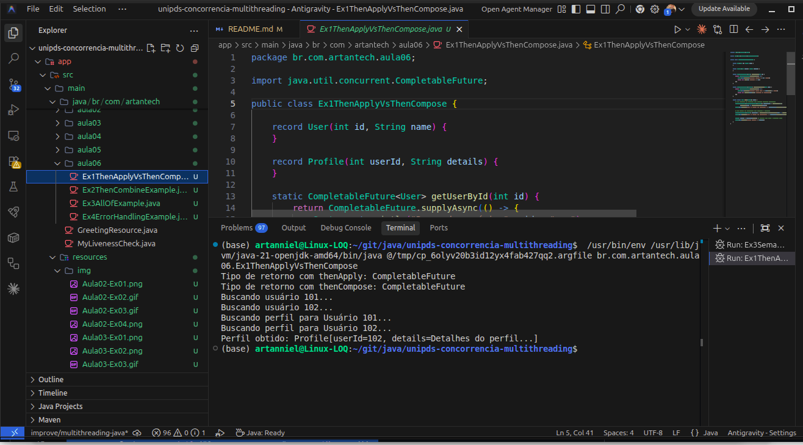

---

### Exercício 2 — Combinação com `thenCombine`

**Classe:** `br.com.artantech.aula06.Ex2ThenCombineExample`

Demonstra como executar duas operações assíncronas **em paralelo** e combinar seus resultados quando ambas terminarem com `thenCombine()`. No exemplo, `getOrderHistory()` (1s) e `getShippingPreferences()` (1.2s) são iniciadas simultaneamente — o resultado combinado chega em ~1.2s, não 2.2s.

**Conceitos abordados:**
- `thenCombine()` para combinar duas futures independentes
- Execução paralela implícita de futures

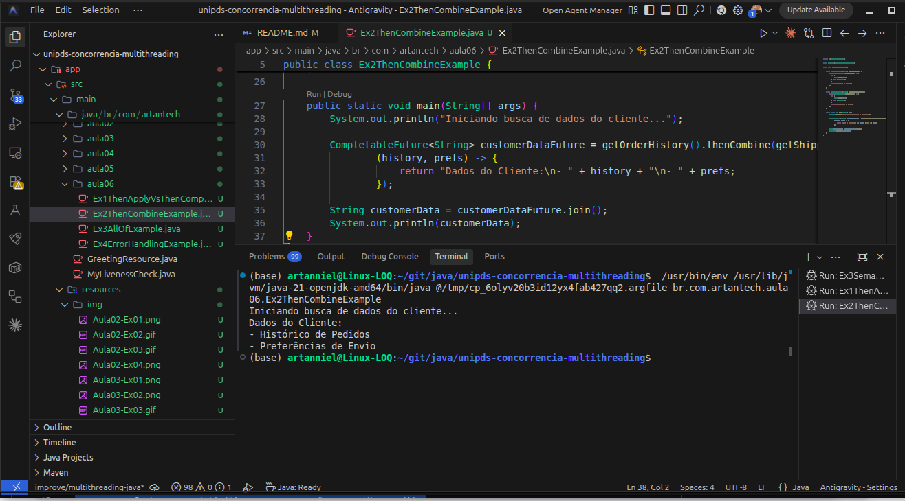

---

### Exercício 3 — Aguardar Múltiplas Futures com `allOf`

**Classe:** `br.com.artantech.aula06.Ex3AllOfExample`

Demonstra o uso de `CompletableFuture.allOf()` para aguardar a conclusão de N futures em paralelo (4 downloads de APIs distintas). Como `allOf()` retorna `CompletableFuture<Void>`, o padrão correto para coletar os resultados é encadear um `thenApply()` que chama `join()` em cada future original (seguro porque já sabemos que todas concluíram).

**Conceitos abordados:**
- `CompletableFuture.allOf()` e seu tipo de retorno `Void`
- Padrão correto para coletar resultados após `allOf`
- `anyOf()` como alternativa (retorna o primeiro a concluir)

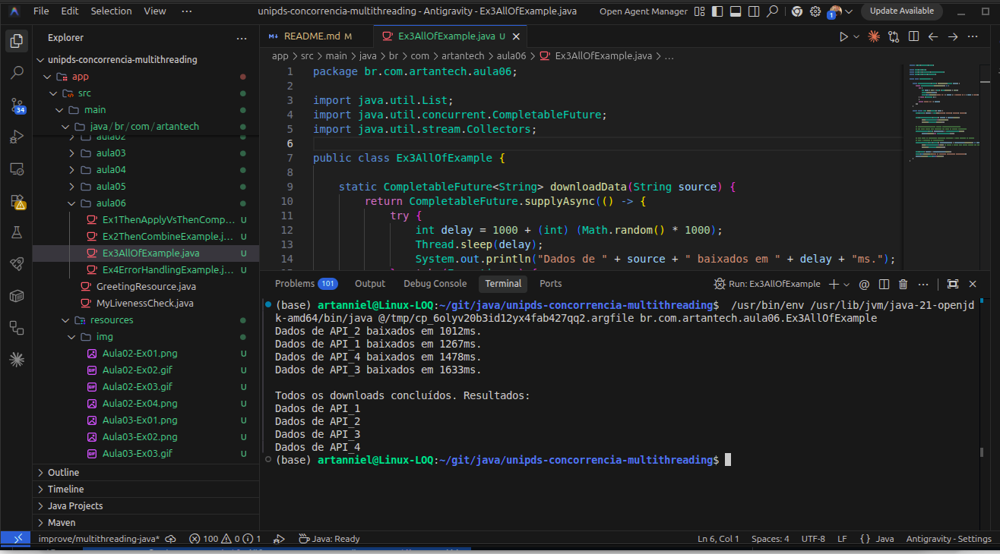

---

### Exercício 4 — Tratamento de Erros

**Classe:** `br.com.artantech.aula06.Ex4ErrorHandlingExample`

Demonstra os dois principais operadores de tratamento de erros em `CompletableFuture`:

| Operador | Análogo a | Comportamento |
|---|---|---|
| `exceptionally(fn)` | `catch` | Só é chamado em caso de exceção; fornece valor de fallback |
| `handle(fn)` | `finally` com retorno | Sempre é chamado; recebe resultado ou exceção (um deles será null) |

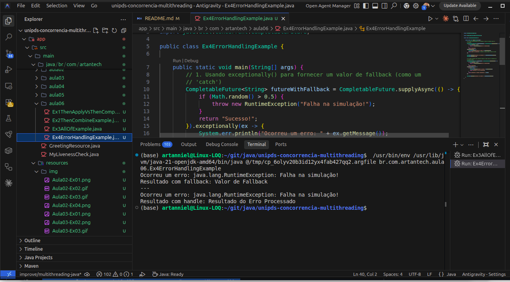

---

## 🔴 Aula 7 — Parallel Streams

Nesta aula exploramos `parallelStream()` — quando ele é uma otimização real e quando se torna um problema. O objetivo é desmistificar o "use parallelStream() para ficar mais rápido" e mostrar os cenários corretos e incorretos de uso.

---

### Exercício 1 — Bom Caso de Uso: Operações CPU-Bound

**Classe:** `br.com.artantech.aula07.Ex1ParallelStreamGoodUseCase`

Encontra a soma dos quadrados de todos os números primos até 10 milhões, comparando a versão sequencial com a paralela. Este é o caso ideal para `parallelStream()`: operação CPU-bound, sem estado compartilhado (stateless), sobre uma fonte facilmente divisível (`ArrayList`). O ganho de performance é real e proporcional ao número de núcleos.

**Conceitos abordados:**
- Quando `parallelStream()` melhora performance
- Critérios: CPU-bound + stateless + fonte divisível

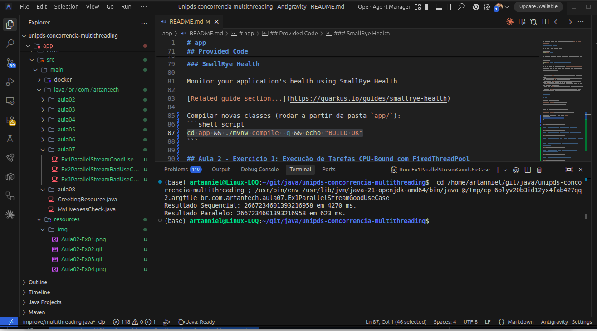

---

### Exercício 2 — Mau Caso de Uso: Operações I/O-Bound

**Classe:** `br.com.artantech.aula07.Ex2ParallelStreamBadUseCaseIO`

Demonstra por que `parallelStream()` é **inadequado** para operações I/O-bound. O `parallelStream()` usa o `ForkJoinPool.commonPool()`, que tem tantas threads quanto núcleos de CPU (~12). Para 20 chamadas bloqueantes de 1 segundo cada, o tempo total será `ceil(20/12) * 1s ≈ 2s` — bem pior do que usar Virtual Threads, que processariam todas as 20 em ~1s.

**Lição:** Para I/O-bound, use Virtual Threads. `parallelStream()` é para CPU.

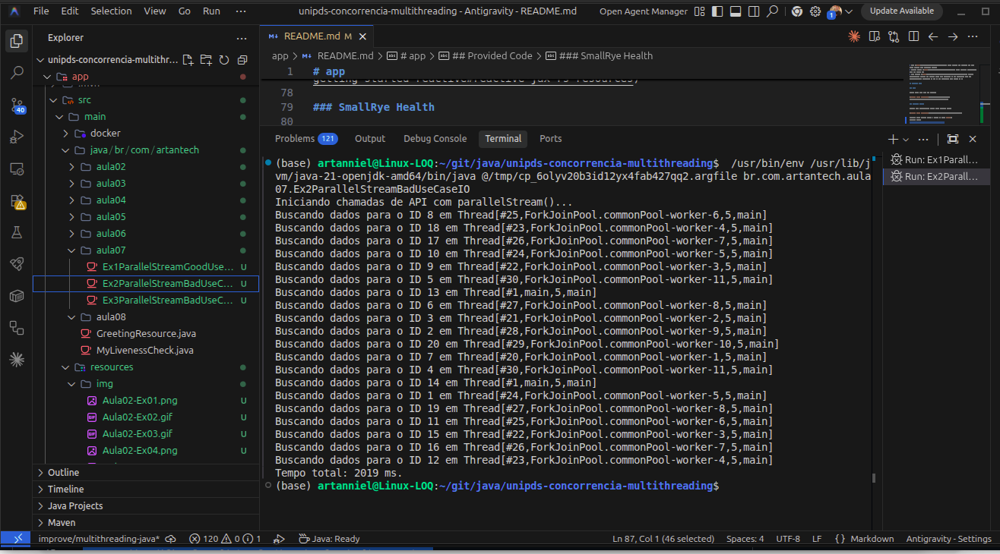

---

### Exercício 3 — Mau Caso de Uso: Estado Compartilhado (Stateful)

**Classe:** `br.com.artantech.aula07.Ex3ParallelStreamBadUseCaseStateful`

Demonstra a condição de corrida clássica ao usar `parallelStream()` com `ArrayList` (não thread-safe). Múltiplas threads chamando `list.add()` simultaneamente geram resultados imprevisíveis: elementos podem ser sobrescritos ou perdidos, e o tamanho final da lista raramente é 1000. A solução correta é usar `.collect(Collectors.toList())`, que é thread-safe por design.

**Lição:** Nunca use `forEach` + coleção mutável em streams paralelos. Use sempre coletores.

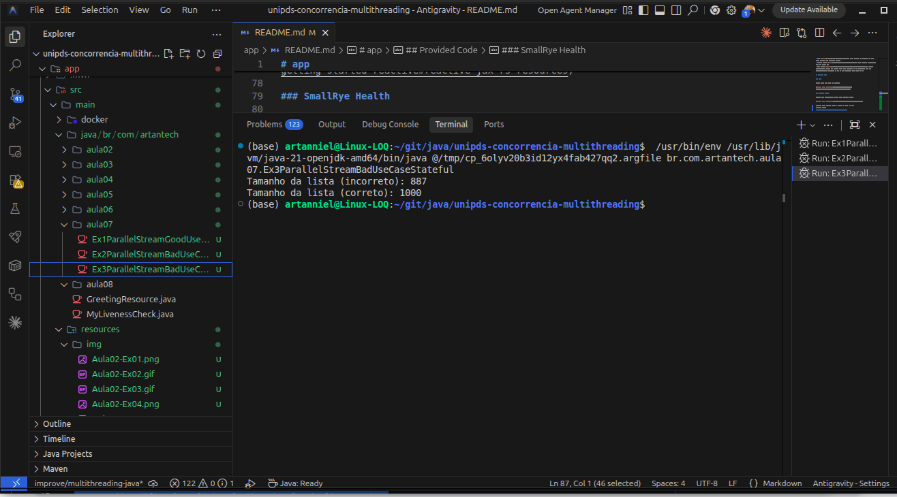

---

## ⚡ Aula 8 — Virtual Threads na Prática

Nesta aula colocamos em prática o que foi aprendido ao longo do curso, combinando Virtual Threads com os padrões de concorrência para cenários de altíssima escala.

---

### Exercício 1 — Concorrência Massiva com Virtual Threads

**Classe:** `br.com.artantech.aula08.Ex1MassiveConcurrencyWithVirtualThreads`

Processa 200.000 requisições simultâneas — cada uma simulando 1 segundo de I/O — em poucos segundos usando Virtual Threads. Com threads tradicionais da plataforma, isso seria impossível sem um servidor dedicado (cada thread consome ~1MB de stack, seriam ~200GB de RAM). As Virtual Threads são gerenciadas pela JVM, mountadas em carrier threads (platform threads) apenas quando estão efetivamente computando, liberando a carrier thread durante operações bloqueantes.

**Resultado esperado:** ~1-2 segundos para processar 200.000 tarefas de 1s cada.

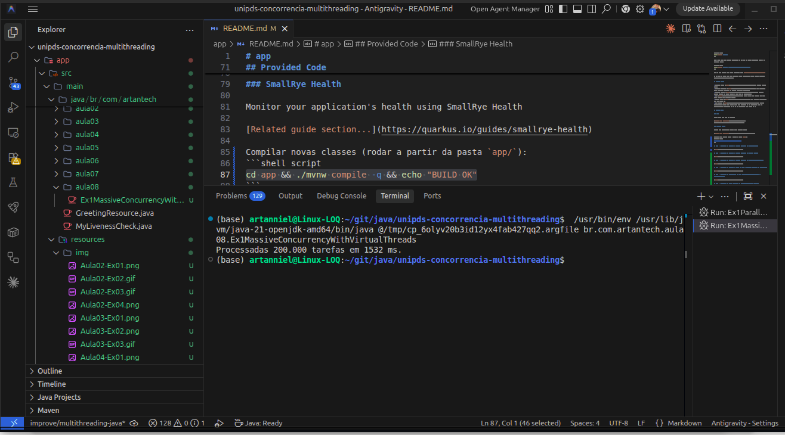

---

## 📖 Guias de Referência

- [Quarkus REST](https://quarkus.io/guides/getting-started-reactive#reactive-jax-rs-resources)
- [SmallRye Health](https://quarkus.io/guides/smallrye-health)
- [SmallRye OpenAPI](https://quarkus.io/guides/openapi-swaggerui)
- [Hibernate Validator](https://quarkus.io/guides/validation)
- [Eclipse Vert.x](https://quarkus.io/guides/vertx)
- [Maven Tooling (Native)](https://quarkus.io/guides/maven-tooling)
- [Java Virtual Threads (JEP 444)](https://openjdk.org/jeps/444)
- [CompletableFuture API](https://docs.oracle.com/en/java/docs/api/java.base/java/util/concurrent/CompletableFuture.html)
